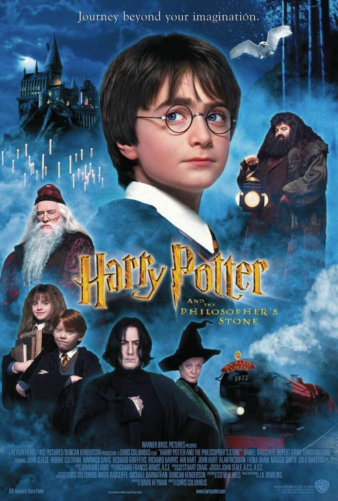

# 영화 포스터 기반 비디오 생성

## 개요
해당 프로젝트는 영화 포스터를 기반으로 비디오를 생성하는 방법을 탐구합니다. 특히, 영화 포스터에서 추출한 프롬프트를 활용해 다양한 AI 모델로 동적인 비디오를 생성하는 것을 목표로 합니다. "Diversity is All You Need" (DIAYN)와 같은 강화학습 기법을 활용하거나 이를 응용하여 프레임 보간(Frame Interpolation) 모델에 적용하는 방법을 고안했습니다.

---

## 미디어

### 예시 포스터
- 해리포터와 마법사의 돌: 

### 생성된 비디오
- 사용된 모델 및 생성된 비디오:
  - **DynamiCrafter**: [DynamiCrafter 비디오](media/DynamiCrafter.mp4)
  - **PyramidFlow**: [PyramidFlow 비디오](media/PyramidFlow.mp4)
  - **Kling 1**: [Kling 1 비디오](media/Standard_Mode_Scene_Visual_Style__A_magical_an.mp4)
  - **Kling 2**: [Kling 2 비디오](media/Standard_Mode_Characters_in_Harry_poter_movie_.mp4)

---

## 프롬프트 탐색

비디오 생성을 위한 효과적인 프롬프트 스타일을 탐구하며, 아래 두 가지 방법을 실험하고자 합니다.

### 방법 1: 직접 프롬프트 생성
DIAYN 개념을 활용하지 않고 수작업으로 프롬프트를 변형하는 방법:
1. 실험할 프롬프트 스타일(예: 길이, 동적 묘사 수준)을 정합니다.
2. 주어진 프롬프트를 다양한 스타일로 변형합니다. 
   - 생성할 프롬프트가 많을 경우 ChatGPT 등을 활용합니다.
3. 각 프롬프트를 사용해 비디오를 생성합니다.
4. 결과를 평가하여 가장 효과적인 스타일을 선정합니다.

### 방법 2: DIAYN을 활용한 Latent Vector 변형
프롬프트를 인코딩한 Latent Vector를 DIAYN 기법으로 변형하여 다양한 스타일을 탐구하는 방법:
1. 프롬프트를 Latent Vector로 인코딩합니다.
2. DIAYN 기법을 사용해 다양한 Latent Vector를 생성합니다.
3. 변형된 Latent Vector로 비디오를 생성합니다.

*현재는 시간과 자원의 제약으로 인해 방법 1을 우선적으로 진행합니다.*

---

## 목표
- 영화 포스터 기반으로 비디오를 생성하기 위한 효과적인 프롬프트 스타일 탐구.
- DIAYN 기법을 응용하여 다양한 비디오 결과물을 생성.
- 프레임 보간(Frame Interpolation) 모델을 개선하고 적용.

---

## 향후 계획
- DIAYN을 활용한 Latent Vector 자동 변형 기능 구현.
- 생성된 비디오의 품질과 다양성을 평가할 지표 강화.
- 고급 프롬프트 엔지니어링 기법 탐구.

---

## 기여
- 비디오 생성에서 강화학습 기법의 가능성을 탐구.
- 다양한 AI 모델을 활용해 동적이고 시각적으로 매력적인 비디오 생성 실험.

---

## 참고
- 관련 논문 및 기술:
  - ["Diversity is All You Need" (DIAYN)](https://arxiv.org/abs/1802.06070)
  - 비디오 생성에서 프레임 보간 기법.
- 생성된 예제는 `media` 폴더에서 확인할 수 있습니다.
